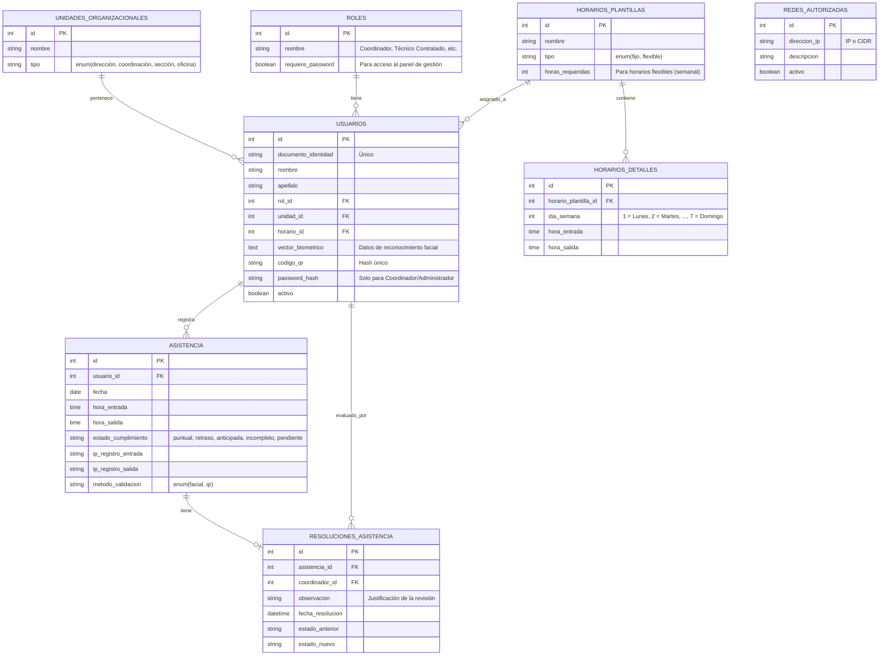

# Diseño de la Base de Datos: Asistencia-NURR

Este documento especifica la estructura y el modelado de datos de la plataforma de control de asistencia para la Unidad de Soporte Técnico de la ULA-NURR. 

La base de datos está diseñada bajo un enfoque relacional, normalizado para permitir flexibilidad en los horarios de pasantes y personal contratado, y estructurada para garantizar la inmutabilidad de los registros históricos.

---

## 1. Diagrama Entidad-Relación (ERD)

---

## 2. Diccionario de Datos

### 2.1 Tabla: `unidades_organizacionales`
Almacena la estructura organizativa de la institución.
*   `id` (INT, PK, Auto_Increment): Identificador único de la unidad.
*   `nombre` (VARCHAR(100)): Nombre descriptivo de la unidad (ej: "Soporte Técnico").
*   `tipo` (ENUM('dirección', 'coordinación', 'sección', 'oficina')): Clasificación jerárquica de la unidad.

### 2.2 Tabla: `roles`
Define los roles asignados a los usuarios del sistema y sus privilegios.
*   `id` (INT, PK, Auto_Increment): Identificador único del rol.
*   `nombre` (VARCHAR(50)): Nombre del rol (ej: "Coordinador", "Técnico Contratado", "Pasante Técnico").
*   `requiere_password` (BOOLEAN): Indica si el rol tiene acceso al módulo de gestión administrativa mediante contraseña.

### 2.3 Tabla: `horarios_plantillas`
Define los contenedores lógicos de horarios para clasificar si son fijos o flexibles.
*   `id` (INT, PK, Auto_Increment): Identificador único de la plantilla.
*   `nombre` (VARCHAR(100)): Nombre descriptivo de la plantilla.
*   `tipo` (ENUM('fijo', 'flexible')): Define si el horario se compone de bloques fijos obligatorios o si es flexible.
*   `horas_requeridas` (INT): Cantidad mínima de horas a cumplir por semana (usado primordialmente para pasantes).

### 2.4 Tabla: `horarios_detalles`
Detalla los bloques horarios específicos asignados por cada día de la semana para una plantilla fija.
*   `id` (INT, PK, Auto_Increment): Identificador único del bloque de detalle.
*   `horario_plantilla_id` (INT, FK): Referencia a la plantilla de horario padre.
*   `dia_semana` (TINYINT): Día de la semana (1 = Lunes, 2 = Martes, ..., 7 = Domingo).
*   `hora_entrada` (TIME): Hora exacta obligatoria para registrar el ingreso.
*   `hora_salida` (TIME): Hora exacta obligatoria para registrar la salida.

### 2.5 Tabla: `redes_autorizadas`
Contiene la lista blanca de direcciones IP o subredes desde las cuales es válido registrar asistencias.
*   `id` (INT, PK, Auto_Increment): Identificador único de la regla de red.
*   `direccion_ip` (VARCHAR(45)): Dirección IP (IPv4/IPv6) o notación CIDR (rango de red).
*   `descripcion` (VARCHAR(255)): Comentario descriptivo del punto físico de conexión.
*   `activo` (BOOLEAN): Indica si la regla de red está vigente.

### 2.6 Tabla: `usuarios`
Entidad principal que almacena los datos de los técnicos, programadores, pasantes y coordinadores.
*   `id` (INT, PK, Auto_Increment): Identificador único de usuario.
*   `documento_identidad` (VARCHAR(20), UNIQUE): Cédula de identidad o pasaporte del usuario.
*   `nombre` (VARCHAR(100)): Nombres del usuario.
*   `apellido` (VARCHAR(100)): Apellidos del usuario.
*   `rol_id` (INT, FK): Referencia al rol asignado.
*   `unidad_id` (INT, FK): Referencia a la unidad organizacional a la que pertenece.
*   `horario_id` (INT, FK): Referencia a la plantilla de horario asignada.
*   `vector_biometrico` (TEXT, Nullable): Representación matemática serializada de los vectores faciales para el reconocimiento biométrico.
*   `codigo_qr` (VARCHAR(255), UNIQUE, Nullable): Hash/código único de credencial QR generado para el usuario.
*   `password_hash` (VARCHAR(255), Nullable): Contraseña encriptada para el acceso a la web administrativa (solo perfiles autorizados).
*   `activo` (BOOLEAN): Estado lógico del usuario (Activo/Inactivo).

### 2.7 Tabla: `asistencia`
Tabla de transacciones históricas que guarda las marcaciones diarias de entrada y salida del personal.
*   `id` (BIGINT, PK, Auto_Increment): Identificador del registro.
*   `usuario_id` (INT, FK): Referencia al usuario que realiza la marcación.
*   `fecha` (DATE): Fecha del registro.
*   `hora_entrada` (TIME): Hora de marcación del ingreso.
*   `hora_salida` (TIME, Nullable): Hora de marcación del egreso (puede ser nula temporalmente si no ha salido).
*   `estado_cumplimiento` (ENUM('puntual', 'retraso', 'anticipada', 'incompleto', 'pendiente')): Categorización automática calculada por el sistema.
*   `ip_registro_entrada` (VARCHAR(45)): IP desde la cual se marcó la entrada.
*   `ip_registro_salida` (VARCHAR(45), Nullable): IP desde la cual se marcó la salida.
*   `metodo_validacion` (ENUM('facial', 'qr')): Método utilizado para verificar la identidad en el dispositivo de marcación.

### 2.8 Tabla: `resoluciones_asistencia`
Almacena el registro de auditoría de las correcciones hechas manualmente por el coordinador sobre las asistencias inconsistentes o incompletas.
*   `id` (INT, PK, Auto_Increment): Identificador único de la resolución.
*   `asistencia_id` (BIGINT, FK): Referencia al registro de asistencia modificado.
*   `coordinador_id` (INT, FK): Referencia al usuario (Coordinador) que aprobó la resolución.
*   `observacion` (TEXT): Justificación del cambio o nota explicativa (ej: "Pasante olvidó marcar salida pero se constató presencialidad").
*   `fecha_resolucion` (DATETIME): Fecha y hora exactas en que se guardó la modificación.
*   `estado_anterior` (VARCHAR(20)): Estado en el que se encontraba la asistencia antes de la resolución.
*   `estado_nuevo` (VARCHAR(20)): Nuevo estado asignado tras la evaluación.
